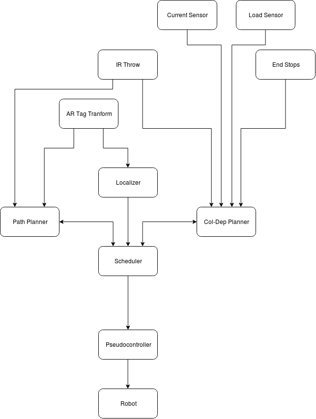
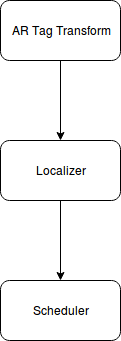
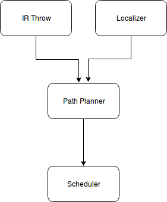
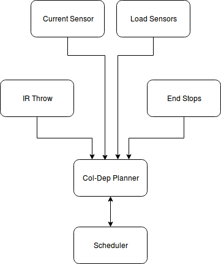

.. role:: math(raw)
   :format: html latex
..

.. role:: raw-latex(raw)
   :format: latex
..

Design and Implementation
=========================

Systems Goals
-------------

The purpose of this system is to operate the robot autonomously for the
full length of the competition.  

System Overview and Description
-------------------------------

The system consists of three major components: localization, navigation, and
collection-deposition. The localization system is labeled as Localizer in
figure 1. The navigation system is labeled as path planner, and the
collection-deposition system is labeled as Col-Dep Planner. The localization
system is responsible for keeping track of where the robot is on the field.
The navigation system controls the path the robot will take to a different
location. The collection-deposition system will control the collection components
of the robot.

   ROS Network Diagram [Figure 1]

localization System
~~~~~~~~~~~~~~~~~~~

The localization system is in charge of finding the location of the robot on the
field at any given time. This will mainly involve looking at an AR tag bundle, which
will be placed on the deposition hopper, with four cameras mounted at different 
locations on the robot. If at any time no cameras see the AR tag, the wheel encoder
information will be used in combination with the robots last known position to make
a guess on where the robot is while its moving until one of the cameras gets a visual
of the AR bundle to correct the location.

Navigation System
~~~~~~~~~~~~~~~~~

The navigation system is used to plot a path from the known location of the robot
to where it wants to be. This system will work with the localization system to monitor
how well the robot is following the computed path and adjust as needed. 

Collection-Deposition system
~~~~~~~~~~~~~~~~~~~~~~~~~~~~

The collection-deposition system controls the bucket system and deposition belt as
well as the two sets of actuators needed to move the collection arm. When the robot
arrives at a mining site, the collection-deposition system will take over and monitor
the depth of the buckets while digging as well as load sensors to know when the robot
is full. Once back at the hopper, the system will run the deposition belt until the 
load sensors indicate the collection bin is empty.

Technologies Overview
---------------------

The system is being developed using ROS 1 kinetic to control inter process
communication between systems. To track the AR tags on the hopper the library
ar_track_alvar is used along with the tf library to transform the data. The
python library inputs is used to take manual input from the xbox controller in
manual mode. The ROS package robot_localization is also being used for sensor
fusion and filtering of input.

Links for further reading of libraries:

    - ROS kinetic: http://wiki.ros.org/kinetic
    - ar_track_alvar: http://wiki.ros.org/ar_track_alvar
    - tf: http://wiki.ros.org/tf
    - robot_localization: http://wiki.ros.org/robot_localization
    - inputs.py: https://pypi.org/project/inputs/

Architecture and System Design
------------------------------

Localization System
~~~~~~~~~~~~~~~~~~~

Technologies Used
^^^^^^^^^^^^^^^^^

The ar_track_alvar library along with the tf library are used by this system. ar_track_alvar
is used to get data about the ar tag bundle such as distance, and angles of rotation using
the cameras. This was developed with a logitech webcam. Recently the cameras being used in the
competition arrived and will be used for this system.

Component Overview
^^^^^^^^^^^^^^^^^^

The localization ROS node will spit out x and y coordinates of the center of the robot.
The coordinate origin is still being determined. Right now the corner of the field with the
hopper will be treated as (0,0) for the field. All the localization system will do is monitor which
camera on the robot is seeing the ar tags, and use the position information about the camera relative to
the robot as well as distance and rotation of the camera relative to the ar tag bundle to determine
where the center of the robot it on the field and possibly return angle of rotation of the robot also.

   Localization Diagram [Figure 2]

Design Details
^^^^^^^^^^^^^^

The localization system takes information from the AR Tag Transform library which is used to
observe the ar tag bundle on the hopper and converts it into x y coordinates. An AR tag bundle
is simple a collection of AR tags. Currently three are being used on the hopper. The localization
system converts the data for use in a ROS messages. The cameras are switched on and off depending
on whether or not they can see the AR tag bundle. When first launching, the system briefly turns
each camera on until it finds one that can see the AR bundle. The camera is then used to get the
distance and angle from the AR bundle. If the camera loses vision of the AR bundle for a specified
time, the camera is shut off and the system checks each camera until the AR bundle is found again.
If at any time no cameras see the AR bundle, the wheel encoder information is used to make an
educated guess on where the robot is relative to its last known location when it could see the AR 
bundle.

Navigation System (Path Planner)
~~~~~~~~~~~~~~~~~~~~~~~~~~~~~~~~

Technologies Used
^^^^^^^^^^^^^^^^^

This system uses the AR throw and sensor information from the ASTRA camera to scan the field and
mark obstacles. Potential functions are used to map a path around the obstacles. The navigation 
system also monitors the data from the localization system to check on the progress the robot is
making as it is traversing the path. The system also uses this information and wheel encoder
from the motors to determine if the robot is stuck, meaning the wheels are turning but the 
location is not changing.

Component Overview
^^^^^^^^^^^^^^^^^^

This system generates a list of points outlining a path and gives the necessary motor control
signals to the wheel to drive along the path. It also takes in localization information to adjust
the path as needed if it begins to wander. When the robot finishes mining the top layer of BP-1,
the robot is rotated to dump the BP-1 off to the side and out of the way of the path to the hopper. 
The navigation system handles rotating the robot 90 degrees from the hole and back. The navigation 
system also handles getting the robot unstuck if it happens to get caught on an obstacle.

   Navigation Diagram [Figure 3]

Design Details
^^^^^^^^^^^^^^

The navigation system controls how the robot gets to a location on the field. Using the IR throw and 
object detection capabilities, it maps out where the obstacles are on the field. This information is
then used to create potential functions to map out a path to the goal while avoiding the obstacles.
The navigation system maps out a path to follow, either from the starting position to a mining 
location, from the hopper to the mining location, or from the mining location to the hopper. The system
also controls moving the robot along the path. The navigation will send wheel speed information to the
pseudocontroller to vary the wheel speed, making the robot drive the path that was planned out in advance.
When moving, error will be introduced, most likely from wheel slippage and uneven terrain. The navigation
continuously monitors information provided by the localalization system to keep track of where the robot
is relative to the path it is supposed to be following. The system will use this information to adjust wheel
speeds in route to correct for the path variation as it occurs.

The navigation system is also responsible for moving the robot away from the mining location temporarily.
When control is given to the navigation system after digging for the first time, the system sends the
necessary wheel commands to rotate the robot 90 degrees. This measurement does not need to be exact. The 
collection system will dump the mined BP-1 then the navigation system will resume control. The system uses
the forward facing ASTRA camera to relocated the hole and the localization information to move the robot to
its exact original mining position to continue digging.

Collection-Deposition System
~~~~~~~~~~~~~~~~~~~~~~~~~~~~

Technologies Used
^^^^^^^^^^^^^^^^^

The collection-deposition system uses two sets of linear actuators to control movement along with a drive
motor for the collection system, and a drive motor for the depostition system. The collection system has
end stop sensors and encoder information from the linear actuators to determine their position. The
deposition system has load sensors in the form of pressure sensors under the collection bin to monitor
how much material is collected. The collection has current sensors to monitor to measure the work load of
the motor.

Component Overview
^^^^^^^^^^^^^^^^^^

The collection-deposition system controls mining the regolith and depositing it in the hopper. Once the robot
arrives at a mining location, the system activates the angle actuators in which angles the collection arm
horizontally then actuates the arm down to begin digging. The system will monitor how far down the buckets are
digging using the actuator positions and monitor the current used by the collection motor to determine how much
the collection system is digging. The system actuates the arm down at varying speed using the current sensor
to dig at a constant rate. The collection system monitors the load sensors on the collection bin and shuts off
the collection belt and actuates the arm up when the collection bin is full. 
The first layer dug will consist of only BP-1 which yields no points. The collection system once full for
the first time, hands control to the navigation system which turns the robot 90 degrees. The deposition system
then dumps the collected material back on to the field, out of the way as to not ubstruct the path to the hopper.
The navitation system then moves the robot back to the hole. The collection system takes over and continues
digging in the same hole, this time reaching the regolith under the BP-1. The system then mines the regolith
until the collection bin is full on the robot. The navigation system drives the robot back to the hopper. Once
in position, the deposition system runs the deposition belt until the collection bin is empty as indicated by
the load sensors. 

   Collection-Deposition Diagram [Figure 3]

Design Details
^^^^^^^^^^^^^^

The ROS node for this system takes in information from the current sensors, load sensors, ASTRA camera, and
actuator end stops and encoders to function. When control is handed off to the collection system by the scheduler
for the first time, the collection system assumes it is at a mining position. The scheduler wont hand off control
if it is not in a valid mining spot. The system first uses the angle actuators to move the collection arm to a set
vertical angle. The system starts running the bucket chain and monitors the intial current being used by the motor
with no load on the collection belt. The bucket chain linear actuators are then used to start shift the bucket chain
toward the ground. As the buckets start digging, the current sensor indicates an increase in current indicating load
on the system. The load is kept constant by continuously running the bucket chain while actuating down. If the current
starts to rise, the downward actuation is temporarily stopped to prevent the bucket chain from being bogged down while
digging. While the process is running, the system also monitors the pressure sensors under the collection bin on the 
robot to determine when it is full. Once full, the collection belt is stopped and the arm is actuated all the way back
up until the end stops are triggered. The system hands off control to the navigation system indicating it is full. The
navigation system then moves the robot 90 degrees. The collection-deposition system then runs the belt and the collection
belt because some of the buckets are still full, until the load sensors indicate the collection bin is empty. This first
stage clears away the top level of BP-1, which os worth no points.

The navigation system then routes the robot back to the mining location, reorienting it with the partially dug hole.
The digging process is repeated, though the arm now digs deeper, collecting regolith. Once the collection bin is full the
second time, the collection arm is retracted and angled down for movement and the navigation system takes control to drive
the robot back to the hopper. The deposition system then runs the deposition and collection belt again until the load sensors
indicate the collection bin is empty.
