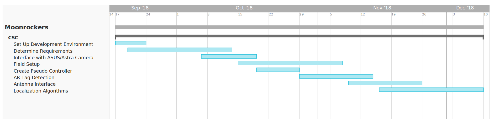

Project Management
==================

Team Member’s Roles
-------------------

- Kyle Lorenz - Software Developer
- Kali Regenold	- Software Developer
- Johnathan Westlund - Software Developer

Project Management Approach
---------------------------

The project will be developed in an agile manner. Sprint lengths with
be one week. Entire team meetings will take place every Monday with additional
autonomy specific meetings will take place on Tuesdays and Thursdays. Trello will be used to manage user stories and the product backlog. The Trello page is accessible by 
anyone on the moonrockers team, but mainly used by the autonomy team. Sprint 
tasks will also be written on the Trello board as well as trouble tickets. 
Git will only be used for code management.

Stakeholder Information
------------------------

The Moonrockers team will be the primary stakeholder along with faculty advisors
for the team.

Customer or End User (Product Owner)
~~~~~~~~~~~~~~~~~~~~~~~~~~~~~~~~~~~~

The final user will be the Moonrockers team. The team as a whole will take responsibility
for managing the product backlog. Because team members enter and graduate, the backlog will
not be managed by a single person. If there are any questions about the backlog the team
members should contact the most recent graduated seniors. 

Management or Instructor (Scrum Master)
~~~~~~~~~~~~~~~~~~~~~~~~~~~~~~~~~~~~~~~

Carter Barkley, the current Moonrockers president will be the Scrum master. Although he will
not directly be involved in the autonomy team, he will lead sprint meetings and monitor
overall progress of the autonomy team as well as aid on collaberation of the autonomy team
with the rest of the Moonrockers team.

Developers – Testers
~~~~~~~~~~~~~~~~~~~~

Kali Reginold is the unofficial project manager. Every member will participate in
development and testing of code. 

Budget
------

The Moonrockers team has a budget of $5000 to cover all expenses for the team. The autonomy
team will be able to use funds as needed with permission from the rest of the team. The
robot and current existing hardware are provided by the team. Any sensors or computers
added by the autonomy team will be provided by the Moonrockers team. Depending on the
equipment used it may be lent to the team for this year only.

Intellectual Property and Licensing
-----------------------------------

Any code and algorithms used will belong to the Moonrockers team for future team use. 
However the autonomy team reserves the right to redistibute written code as our own.

Sprint Overview
---------------

Sprint cycles run every week, ending at the usual Moonrockers meeting time.
While Trello is being used to manage tasks and timelines for completion.

Terminology and Acronyms
------------------------

ROS - Robot Operating System
OpenCV - Open Computer Vision
OpenNI - Open Natural Interaction
RViz - 3D visualization software for ROS
RGBD - Red, Green, Blue, Distance Camera (Distance from IR Throw)
IR - Infrared

Timeline
--------

Development Environment
-----------------------

Primary environment is Linux on personal laptops.
Code from personal computers will be pushed to the GitLab repository where it
will then be pulled onto the on-board computers.
Setup information can be found below.

Development IDE and Tools
-------------------------

Since the development environment is on a linux machine and most of
the code is written in python, there is no required IDE and each
developer may use whatever text editor they are most comfortable 
with.

For tools/dependencies all of the following are required: 

* ROS Kinetic With the following packages:
	- Catkin
	- OpenNI
	- AR_Track_Alvar
	- OpenCV3
	- RVIZ
* Python
* C++
* AVR Tools
* OpenCV

Source Control
--------------

The Moonrockers team uses a Gitlab repository for source control of
the current systems on the robot. This is located on the global 
gitlab domain.

For our Sr. design project documentation we have a separate
repository on the SDSMT Gitlab domain.

Using Git for our souce control allows us to use a heirachical
structure for our branching system.  Master and Dev. branchs
is protected with gated checkins.  Each change made to dev has a
dedicated branch for that feature's development.

Build Environment
-----------------

The build and run environment is Ubuntu 16.04 64bit.  This is the 
only version of Ubuntu that will run ROS Kinetic easily. Most of 
the packages are to be written in python and do not need to be 
compiled. Any of the C/C++ code can be compiled with GCC or
Makefiles. 

Development Machine Setup
-------------------------

The following is general a list of the required steps to setup the
development environment.

* Install Ubuntu 16.04 64bit.
* Install ROS 1 Kinetic.
* Install and Compile OpenCV.
* Install all of the aforementioned ROS Packages.
* Install of the AVR Tools.
