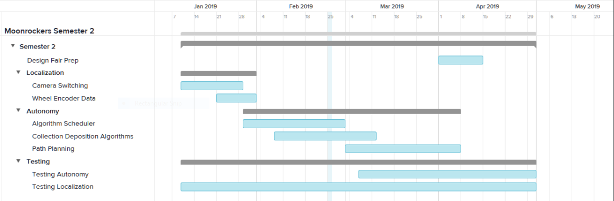

Project Management
==================

Team Member’s Roles
-------------------

- Kyle Lorenz - Software Developer
- Kali Regenold	- Software Developer
- Johnathan Westlund - Software Developer

Project Management Approach
---------------------------

The project will be developed in an agile manner. Sprint lengths will
be one week. Entire team meetings will take place every Monday with additional
autonomy specific meetings will take place on Tuesdays and Thursdays. Trello 
will be used to manage user stories and the product backlog. The Trello page 
is accessible by anyone on the Moonrockers team, but mainly used by the autonomy
team. Sprint tasks will also be written on the Trello board as well as trouble 
tickets. Git will be used for code management as well as documentation.

Stakeholder Information
------------------------

The Moonrockers team will be the primary stakeholder along with faculty advisors
for the team.

Customer or End User (Product Owner)
~~~~~~~~~~~~~~~~~~~~~~~~~~~~~~~~~~~~

The final user will be the Moonrockers team. The team as a whole will take responsibility
for managing the product backlog. Because team members enter and graduate, the backlog will
not be managed by a single person. If there are any questions about the backlog the team
members should contact the most recent graduated seniors. 

Management or Instructor (Scrum Master)
~~~~~~~~~~~~~~~~~~~~~~~~~~~~~~~~~~~~~~~

Carter Barkley, the current Moonrockers president, will be the Scrum master. Although he will
not directly be involved in the autonomy team, he will lead sprint meetings and monitor
overall progress of the autonomy team as well as aid on collaboration of the autonomy team
with the rest of the Moonrockers team.

Developers – Testers
~~~~~~~~~~~~~~~~~~~~

Kali Regenold is the unofficial project manager. Every member will participate in
development and testing of code. 

Budget
------

The Moonrockers team has a budget of $5000 for the 2018-19 year to cover all 
expenses for the team. The autonomy team will be able to use funds as needed with permission from the treasurer. The robot and current existing hardware are provided by the team. Any sensors or computers added by the autonomy team will be provided by the Moonrockers team. Depending on the
equipment used it may be lent to the team for this year only.

Intellectual Property and Licensing
-----------------------------------

Any code and algorithms used will belong to the Moonrockers team for future team use. 
However the autonomy team reserves the right to redistribute written code as our own.

Sprint Overview
---------------

Sprint cycles run every week, ending at the usual Moonrockers meeting time.
While Trello is being used to manage tasks and timelines for completion,
a weekly meeting is held with the all discipline groups and advisors to Moonrockers.

Terminology and Acronyms
------------------------

- ROS - Robot Operating System
- OpenCV - Open Computer Vision
- RViz - 3D visualization software for ROS
- AR Tag - A B/W square used for detecting orientation
- Pseudocontroller - The system in charge of handing motion commands to the hardware
- Scheduler - The system that decideds the ordering of events in order make progress
- Localization - The system in charge of locating the robot on the field
- Path Planner - They system in charge of deciding how to reach the next location on the field
- Wheel Encoder - A device used to measure wheel velocities
- Collection System - The bucket system located at the front of the robot
- Deposition System - The conveyor belt system located at the rear of the robot

Timeline
--------
.. image:: gantt.png

Development Environment
-----------------------

The primary development environment is Ubuntu 16.04 on personal laptops and the robot's Raspberry Pi and Odroid.
Code from personal computers is normally pushed to the GitLab repository where it
can then be pulled onto the on-board computers. Setup information can be found below.

Development IDE and Tools
-------------------------

Since the development environment is on a Linux machine and most of
the code is written in python, there is no required IDE and each
developer may use whatever text editor they are most comfortable 
with.

For tools/dependencies all of the following are required: 

* ROS Kinetic With the following packages:
	- catkin
	- ar_track_alvar
	- OpenCV3
	- RVIZ
* Python
	- rospy

Source Control
--------------

The Moonrockers team uses a GitLab repository for source control of
the current systems on the robot. This is located on the global 
GitLab domain.

For our senior design project documentation we have a separate
repository on the SDSM&T GitLab domain.

Using Git for our source control allows us to use a hierarchical
structure for our branching system.  Master and dev branches
are protected with gated check-ins.  Each change made to dev has a
dedicated branch for that feature's development.

Build Environment
-----------------

The build and run environment is Ubuntu 16.04 64bit.  This is the 
only version of Ubuntu that will run ROS Kinetic easily. Most of 
the packages are to be written in python and do not need to be 
compiled. Any of the C/C++ code consists of already existing 
libraries and low level hardware interface binaries.

Development Machine Setup
-------------------------

The following is general a list of the required steps to setup the
development environment.

* Install Ubuntu 16.04 64bit.
* Install ROS Kinetic.
* Install all of the aforementioned ROS packages.
* Install and setup catkin for kinetic.
* Using the catkin workspace clone the Moonrockers Hardware Interface repo.
* Also clone the Moonrockers autonomy_odroid and autonomy_pi repos.