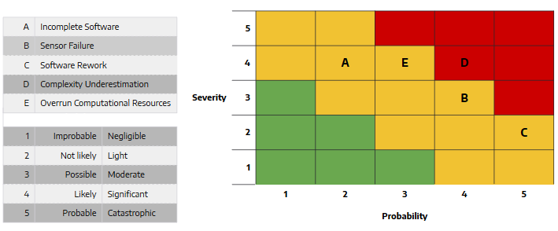

System and Unit Testing Design
==============================

This section describes the approach taken with regard to system and unit
testing. This chapter does not describe the outcome of those tests. That
will be described in the prototypes chapter.

Overview
--------

This project faces several challenges to ensure a successful competition run.
The code will not be running in a perfect or stable environment and any number
of problems may occur within the code, on the computers, or on th physical bot.
For these reasons, we have employed careful testing of our system in an 
automated and manual fashion.

Dependencies
------------

There are several dependencies for the projects testing design. For the
purposes of this testing document we will divide the dependencies into
software and hardware categories.

Below are a list of testing software/framework dependencies for this 
project:

* An Ubuntu 16.04 OS
* Python 2.7
* ROS Kinetic setup in as described in the project development environment section.
* Access to the Moonrockers code repository.
* A WIFI network connection shared with the robot.
* SSH capability (for communication with robot's systems)

Below are a list of testing hardware dependencies for this project:

* Test competition arena (to scale)
* Test deposition hopper (to scale)
* Hopper AR-Tag Bundle (exact layout described in the repository documentation)
* The Moonrockers competition robot
* Xbox 360 Controller (manual robot control)
* Development computer (with aforementioned software)

Test design and setup
---------------------

Additional resources are available to do physical testing of the robot in a mock
competition environment. There is a taped full-scale outline of the competition
field indoors in the Moonrockers workspace. The hopper location is also taped
out. This field is used for location testing as well as some navigation testing.
The robot can see the AR tags on a fake hopper and determine its location on the
field. This setup is used for basic navigation testing only since the excavation
system cannot operate on concrete and the robot moves differently on concrete
than it does on a sandy surface. There will be a full sized practice arena with
gravel and dust simulating the conditions that will exist in the competition,
however this is still being constructed. There is also a volleyball court which
is used to test the behavior of the robot while driving on sand as well as
testing the excavation system by digging in the sand.

The tests are categorized by which system they directly interact with. Each
system will be tested physically and with in code tests with mock data when
possible for quick and easy repeatability. The tests ensure all systems operate
as intended as well as handle unintended situations gracefully.

Localization
~~~~~~~~~~~~

Recall the localization system is in charge of keeping track of the robots
coordinate location and rotation on the field. Testing of the localization
system will consist of physical tests as well as unit testing of the individual
components. Since cameras are not yet mounted on the robot, a cardboard cutout
is used to hold the cameras at similar locations and angles relative to each
other as they will be mounted on the robot. This cardboard cutout is placed at
various locations marked out on the taped outline of the field. The localization
algorithm computes the x and y coordinates of the center of the robot or center
of the cameras (The corner with the hopper is (0,0)). The computed coordinates
are compared to the actual measured coordinates of the cardboard cutout and
verified for accuracy. The localization also reports the angle of the robot so
the cardboard cutout is rotated to three different angles at each location. This
relies on camera switching to work. Testing the actual algorithm without
physically moving the cameras is done by mocking the data being sent by the
cameras, but since the data is complex to mock, the camera data is recorded so
the same data can be fed in to the localization node consistently and the
results should not vary. Though the data is filtered so exact matching of
results is not expected. Once the cameras are mounted to the robot, moving tests
will be conducted to ensure the coordinates of the robot are being correctly
recomputed as the robot moves as well as ensuring the cameras can maintain view
of the AR tags while shaking. Because the hopper could be on either side of the
field, depending on which competition field we are given, the tests will be run
in each configuration to ensure the robot can handle both situations. 

Environmental tests will be conducted once the practice field is built. This
will ensure the cameras can maintain sight of the AR tags while moving within a
dusty environment and uneven terrain. A similar testing method will be used in
this environment. 

Camera switching will also be tested with localization. Because of USB
limitations, only two cameras can be turned on at once. Therefore if a camera
can not see the AR tags, it turns off. If a camera can see the AR tags, then
that camera will be used until the robot rotates in such as way the camera loses
the tags. Then the camera will shut off and the remaining cameras are cycled
through until the AR tags are picked up again. This algorithm is initially
tested with the cardboard cutout holding the cameras and simply rotating it so
different cameras have to be used, ensuring data is always being sent out from
at least one camera. This testing will later be combined with physically testing
the location data on the field once the cameras are properly mounted. 

Navigation
~~~~~~~~~~

The navigation system finds a path from the robot's current location to the goal
and controls how the robots drives along the path. The system takes in location
data from the localization system, plans a route to a goal, and feeds wheel
speed signals to the drive motors to move the robot. The simple physical tests
used for this algorithm consist of placing the robot down at a set location on
the field and manually enter a goal location to drive to. With no obstacles the
navigation system should plan a straight line path and follow the line, stopping
at the goal. Note the localization system must also work for this test since the
coordinates are needed to monitor progress on the path. Once the practice field
is built, realistic obstacles can be added to test how the navigation system
routes around them. Depending on how craters and hills look on camera, they may
be able to be mocked on the taped out field in the lab for earlier testing.
Because the robot may not always be available, mock location data can be created
to simulate the robot moving. A location will be given to the navigation system
which will then begin to move the robot, we will then monitor the wheel speed
signals coming from the navigation system and use the robot's kinematics to map
out where the robot should be going and feed adjusted location data as needed.
The navigation system will then believe it is moving which will allow us to
observe how well the navigation system is working without always running it on
the robot. This method can be automated but is far from ideal as it is difficult
to accurately simulate where the robot will go given certain wheel speeds
because of motor variations and wheel slippage on the terrain. 

Although the obstacles in the competition last year were too small to cause
concern for the robot, the navigation system will still take in depth
information from an ASTRA camera to assist with navigating around obstacles as
necessary. This information along with the goal will be used to develope
potential fields which will be used to plan a route for the robot to follow.
Since these fields vary depending on the start and end location as well as
obstacle location, it would be difficult to mock out a "correct" potential field
to compare the navigation system's output to. Instead the generated path will
have to be manually checked to see if it will work for the given scenario. This
testing will not be automated and rely on physically showing the ASTRA camera
the field since the data the camera generates would be too complex to mock out.

Collection
~~~~~~~~~~

The collection system controls when to dig, how deep to dig, and when to stop
digging. It receives information from the load sensors on the collection bin to
determine how much regolith has been collected as well as encoder information
from the linear actuators and current draw information from the collection
system drive motor. Testing the entire operation of this system requires the
practice pit to be complete to simulate the exact conditions of the competition.
However individual components of the algorithm can be tested. If a certain event
occurs, certain events should be triggered. The load sensors indicate when the
collection bin on the robot is full. Data from these sensors can be mocked and
fed to the collection system. If the sensors read the bin is full, the system
should stop the collection belt and raise the collection arm up all the way.
This section can be tested in code because it requires simple data mocking and
the signals ROS sends to the collection motor and actuators can be intercepted
and verified that they sent the proper command. In a similar manner, the
regolith that should be collected is buried beneath 30cm of BP-1 dirt which
needs to be removed. The system should dig until the linear actuators indicate
they are extended 30cm into the ground. The actuators should then stop and the
deposition belt run while the excavation belt continues to run to dump all BP-1
from the collection bin as well as the collection belt. The trigger for this
event is the actuators are 30cm below the surface, fake actuator data is sent to
the collection system which should cause the actuators to stop and the
deposition bin to be emptied. This can again be tested in software. 

When digging the collection system has to lower the actuators to extend the
digging arm into the regolith without overloading the collection motor. If the
collection motor is drawing too high of voltage the linear actuators lowering
the collection belt should stop to allow the collection belt to catch up. This
is easily tested in code by sending fake voltage data to the collection system
which should then pause the linear actuators. 

Deposition
~~~~~~~~~~

The deposition system controls emptying the collection bin on the robot. It
takes input from the load sensors under the collection bin and outputs drive
signals to the deposition belt motor. When the scheduler tell the deposition
system to activate, the motor should run until the collection bin is emptied
according to the load sensors. The test for this system is run in code by
sending mock load sensor information indicating the bin is full then information
indicating the bin is empty and monitor the signal sent to the deposition motor
to determine if the motor was started and stopped at the right time.

Contingency
~~~~~~~~~~~

Contingency testing is its own section and consists of a variety of different
tests for individual systems as well as the robot as a whole. These tests check
how the robot responds to situations it shouldn't be in, such as getting stuck
or receiving conflicting data or the loss of a sensor. 

A situation that was tested in the volleyball court was how to handle getting
stuck. The robot was placed in a hole it couldnt drive out of. Under manual
control the driver quickly switched from a left and right turn which caused the
hole walls to collapse and the robot to gain traction again. We will implement a
similar method if at any point the wheels are spinning and the location system
says the robot is not moving. This testing will ensure the robot can not get
stuck in the field. 

Another contingency test will monitor how the localization system handles a
camera failure if a camera becomes obstructed. Because of the camera field of
view and the layout on the robot, there will always be one camera that will see
the AR tags to get localization information. If a camera fails and the robot is
rotated in a certain way, no camera will see the AR tags. The camera switching
algorithm rotates through each camera until it finds one with a view of the
tags, or all cameras were checked. If no camera sees the tags, the robot will
continue operating using wheel encoder information to make an educated guess of
where it is on the field relative to its last known location. If after a certain
amount of time the cameras still fail to see the AR tags the robot will stop and
rotate which hopefully will let a different camera see the tags and update the
location. The camera cycling component can be testing with code but not easily
because of the need to mock the camera data so this particular test will need to
be done with the physical robot to ensure accuracy.

Contingency test that are easy to implement but much harder to come up with a
solution to are situations where sensors are giving different information about
the same thing. There are two sets of actuators to move the collection arm, each
having end stop sensors and encoder information being sent to ROS. There are
also two load sensors measuring the collection bin. The ROS nodes in charge of
distributing the information from these sensors looks at both sensors, which
should be the same, and send the information throughout the ROS network. Signals
from the sensors can be fixed so they send conflicting information as well as
disconnected completely to see how the system responds.

System Testing
--------------

This section focuses on the system testing or the methods that could be
used to fully end to end test the robotic systems in a competition like
environment. It should be noted that fully automated end to end testing 
of the robot is out of the scope of 2018/2019 autonomy project. For this
project we are preforming manual system testing using verification of 
real world results. The automated end to end testing can be preformed with
a ROS simulation package called Gazebo.  However, automated testing with
gazebo requires a lot of time to setup and extensive 3d modeling of the 
physical robot and environment.

For system tests relating to accuracy, particularly in relation to the
localization systems, we use manual measurement with tape measures to 
verify the correctness of a particular distance or position measurement.
Other accuracy tests may include changing the state or conditions the 
system is operating in and then verifying the accuracy manually again.

Like with accuracy system tests, tests for resilience to failure are done by 
changing the state of the system or the operating conditions to something
less desirable and noting the results and the ability of the system to
cooperate with the challenge. In addition to changing the operating
conditions we also can spoof sensor data using ROS's built in 
publisher/subscriber framework. With the ability to spoof sensor data,
false sensor readings can be sent to various other parts of the system
to see how they respond.

For a repeatability system tests, keeping the environment and state of the
system the same is important. If this portion of the system testing was
performed on an automated simulation environment, this would be trivial.
Without simulations, however, careful attention must be given to the state
of the system, the starting state of the robot, and the environment it is 
in. Keeping these variables the same (within reason) helps to repeatedly
test and manually measure the results to very repeatability of a given
system. Having an active SSH connection into the system helps with 
resetting the state of the system after each test iteration.  Values of
interest are recorded by hand or electronically and the results of several
runs can be compared for consistency.

System Integration Analysis
---------------------------

Apart from testing of overall requirements for the project, there is a 
need for testing of other aspects of the systems.  These tests are more
of a benchmark for how well a specific requirement was fulfilled and not
on whether the requirement was met.

One such test is the system resources test. Since these algorithms are
being run on relatively small SOCs like a Raspberry Pi or an O-Droid,
the system needs to be efficient. Efficient code is important for
reliability of the system.  If a given algorithm uses too much resources
it may cause issues for the other systems trying to run the robot such as
the scheduler or other important operations.

This ensures that future expansions to the algorithms are easy and require
fewer large scale changes to the system due to an overrun of system
resources. 

Repository Testing
------------------

For the GitLab repository, we ensure that things do not easily get broken
with simple gated check-ins using continuous integration checking for basic
syntax validity checking. A master branch is kept clean of commits and is
only merged from a dev branch. Dev gets merged to from various feature
branches. 

This setup is easily expendable and unit-tests could be added in the
future, however, a need for unit testing hasn't been found. This is largely 
in part to the manual nature of many of the tests required. 

Risk Analysis
-------------

Figure 1 (below) shows a risk analysis table, with failure severity on 
the y-axis and failure likelihood on the x-axis. Of most importance are
the items listed in the upper right region of the table. These items
correspond to the most likely and most severe risks on our project.

	Risk Analysis Chart [Figure 1]

For the Moonrockers project, our biggest risk concern is complexity
underestimation.  This is a fairly common risk among most larger projects
and this project is no exception. The risk is severe due to the delays 
complexity underestimation can bring into a project.

Risk Mitigation
~~~~~~~~~~~~~~~

A lot of risk comes from the code itself and therefore we have several risk 
mitigation strategies to ensure a successful system.

*Code Review*
The most basic safeguard against errors is more than one pair of eyes on code.
When code is merged from a feature branch to dev (or from dev to master), we 
review the code to ensure no easy to catch bugs slip through.

*Testing*
The testing plan above outlines how we plan to catch sneakier errors that can
cause fatal flaws in our system. Through automated and manual testing, we ensure
that the robot successfully runs the competition in an unstable environment.

*Redundancy*
Redundancy is the most important risk mitigation strategy we employ.
There are some risks that we have no control over and have to deal with if they
arise. Redundancy in hardware and software help the robot recover from failures.
For example, there are multiple cameras on the robot so that losing a single
camera feed will not stop the robot's competition run.
